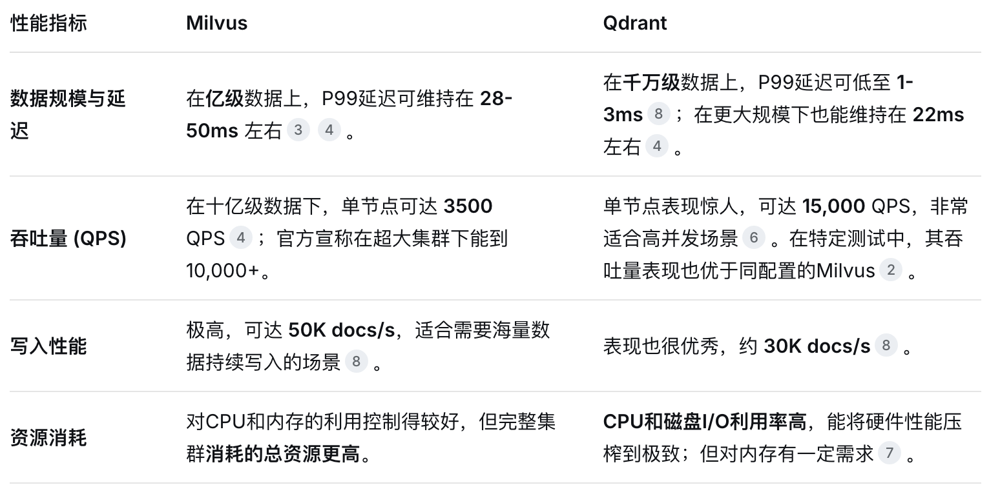
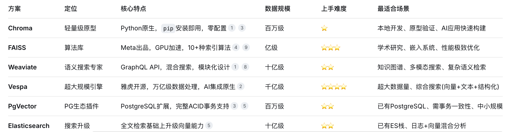

Milvus 是一个开源的、专为处理海量非结构化数据而设计的向量数据库

# 部署模式
## Milvus Lite	
轻量级Python库，可通过pip install pymilvus直接集成到代码中。	

快速原型开发、学习测试、在Jupyter Notebook中运行、资源有限的边缘设备。

---

pip install -U pymilvus

自动安装 pymilvus 及其内嵌的 milvus-lite 组件

```py
from pymilvus import connections
connections.connect(host='127.0.0.1', port='19530')
print("Milvus Lite 连接成功！")
```

## Milvus Standalone	
单机版，所有组件打包在一个Docker镜像中，可以一键启动。	

中小规模的生产应用，性能和数据量（约千万级向量）要求不高的场景。
## Milvus Distributed	

分布式集群，部署在Kubernetes上，具备完整的云原生能力。	

大规模、高可用的企业级生产环境，需要处理十亿甚至百亿级别的向量数据。
## 云服务（如阿里云Milvus版）	

由云厂商提供的全托管服务，100%兼容开源API。	

希望免运维、享受更高性能（宣称有3-10倍提升）、与云上AI生态无缝集成的企业。


# milvus和qdrant对比

Milvus 是专为「超大规模、企业级生产环境」设计的重型武器，
而 Qdrant 则是以「高性能、低延迟、过滤能力强」著称的轻量级高手




